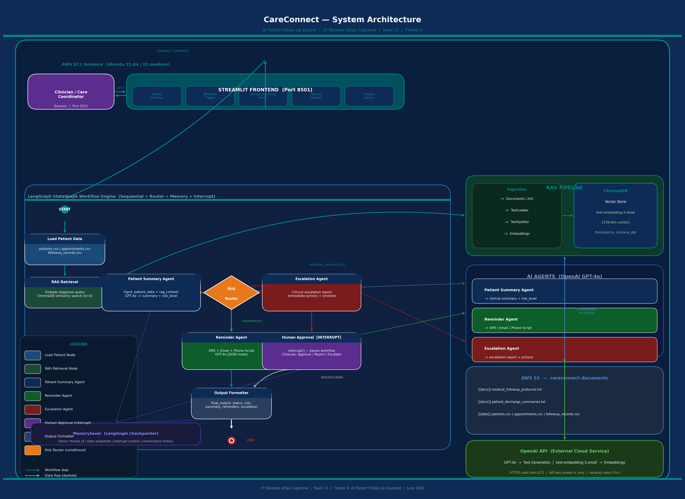

# CareConnect — AI-Powered Patient Follow-Up System

[](https://www.python.org/downloads/)
[](https://ai.google.dev/gemini-api)
[](https://github.com/langchain-ai/langgraph)
[](https://streamlit.io/)

> **IIT Roorkee AIOps Capstone Project | Team 11 | Theme 9**  
> An intelligent healthcare assistant that automates patient follow-up management using AI agents, RAG, and human-in-the-loop workflows.

---

## 📋 Table of Contents

- [Overview](#overview)
- [Features](#features)
- [Architecture](#architecture)
- [Project Structure](#project-structure)
- [Installation](#installation)
- [Quick Start](#quick-start)
- [Usage](#usage)
- [Configuration](#configuration)
- [Deployment](#deployment)
- [Documentation](#documentation)
- [Contributing](#contributing)
- [License](#license)

---

## 🎯 Overview

**CareConnect** is an AI-powered patient follow-up and reminder management system designed to help healthcare providers efficiently manage post-discharge patient care. The system uses:

- **GPT-4** for intelligent clinical analysis and personalized communication
- **LangGraph** for orchestrating complex multi-agent workflows
- **RAG (Retrieval-Augmented Generation)** for context-aware medical protocol adherence
- **Human-in-the-Loop** for critical patient escalations
- **Streamlit** for an intuitive clinical dashboard

### Key Capabilities

✅ Automated patient risk assessment (Low, Medium, High, Critical)  
✅ Personalized follow-up reminders (SMS, Email, Phone Scripts)  
✅ RAG-based medical protocol retrieval  
✅ Human approval workflow for high-risk patients  
✅ Multi-channel communication generation  
✅ Real-time clinical dashboard  

---

## ✨ Features

### 1. **Intelligent Patient Summarization**
- Analyzes patient demographics, diagnosis, appointment history, and follow-up records
- Generates concise clinical summaries with risk stratification
- Identifies key concerns and recommended actions

### 2. **RAG-Powered Context Retrieval**
- Retrieves relevant medical protocols from a vector database
- Ensures follow-up plans align with clinical guidelines
- Supports both local and AWS S3 document storage

### 3. **Multi-Agent Workflow**
- **Patient Summary Agent**: Clinical analysis and risk assessment
- **Reminder Agent**: Personalized multi-channel reminders
- **Escalation Agent**: Critical patient escalation reports

### 4. **Human-in-the-Loop Approval**
- Automatic escalation for HIGH/CRITICAL risk patients
- Clinician review interface with approve/reject/escalate options
- Audit trail for all decisions

### 5. **Streamlit Dashboard**
- Patient selection and overview
- One-click follow-up plan generation
- Interactive approval workflow
- Session history tracking

---

## 🏗️ Architecture



### System Components

#### 1. **Frontend Layer** (Port 8501)
- **Streamlit Dashboard**: Web-based clinical interface
  - Patient Selection
  - Risk Assessment Display
  - Human Approval Interface
  - Session History
- **Access**: Browser-based (AWS EC2 or localhost)

#### 2. **LangGraph Workflow Engine**
Sequential workflow with conditional routing and human-in-the-loop:

**Workflow Steps:**
1. **START** → Load Patient Data (CSV: patients.csv, appointments.csv, followup_records.csv)
2. **RAG Retrieval** → Fetch relevant medical protocols from ChromaDB
3. **Patient Summary Agent** → Generate clinical summary + risk assessment (Gemini 3.1 Flash Lite)
4. **Risk Router** → Route based on risk level:
   - **Low/Medium** → Reminder Agent
   - **High/Critical** → Escalation Agent
5. **Escalation Agent** → Generate escalation report (for high/critical patients)
6. **Human Approval [INTERRUPT]** → Clinician review (Approve/Reject/Escalate)
7. **Reminder Agent** → Generate multi-channel reminders (SMS, Email, Phone Script)
8. **Output Formatter** → Format final output with status, summary, reminders, escalation
9. **END** → Return to Streamlit frontend

**Memory Management:**
- **MemorySaver (LangGraph Checkpointer)**: Maintains thread_id, state snapshots, interrupt context, conversation history

#### 3. **AI Agents Layer** (Google Gemini 3.1 Flash Lite)

**Patient Summary Agent:**
- Input: patient_data + rag_context
- Output: clinical_summary + risk_level
- Model: Gemini 3.1 Flash Lite with structured JSON output

**Reminder Agent:**
- Input: patient_data + summary + rag_context
- Output: [SMS, Email, Phone Script]
- Model: Gemini 3.1 Flash Lite with structured output

**Escalation Agent:**
- Input: patient_data + summary
- Output: escalation_report + actions
- Model: Gemini 3.1 Flash Lite with clinical brief

#### 4. **RAG Pipeline** (Retrieval-Augmented Generation)

**Components:**
- **Document Ingestion**: Direct protocol text/PDF chunking from `data/protocols`
- **Retrieval**: ChromaDB similarity search over embedding vectors
- **Vector Store**: ChromaDB local persistent storage under `chroma_db/`

**Document Sources:**
- Local: `data/protocols/*`
- Cloud: AWS S3 bucket (optional fallback)

#### 5. **Data Layer**

**CSV Datasets:**
- `patients.csv`: Demographics, diagnosis, risk_level, medications
- `appointments.csv`: Appointment history, dates, physicians
- `followup_records.csv`: Follow-up status, dates, notes

**AWS S3 (Optional):**
- Bucket: `careconnect-documents`
- Paths: `/documents/`, `/datasets/`
- Files: medical_followup_protocols.txt, patient_discharge_summaries.txt

#### 6. **External Services**

**Google Gemini API:**
- Gemini 3.1 Flash Lite: Text generation (clinical summaries, reminders, escalations)
- HTTPS: Secure API calls with retry logic (3x)

**AWS Services (Optional):**
- EC2: Application hosting (Ubuntu 22.04, t2.medium)
- S3: Document storage and retrieval
- IAM: Access key management

### Data Flow

```
Clinician → Streamlit UI → Select Patient (P001)
                ↓
        LangGraph Workflow START
                ↓
        Load Patient Data (CSV)
                ↓
        RAG Retrieval (ChromaDB) → Medical Protocols
                ↓
        Patient Summary Agent (GPT-4o) → Risk: HIGH
                ↓
        Risk Router → HIGH → Escalation Agent
                ↓
        Escalation Agent (GPT-4o) → Escalation Report
                ↓
        Human Approval [INTERRUPT] → Clinician Reviews
                ↓
        Decision: APPROVE
                ↓
        Reminder Agent (GPT-4o) → SMS + Email + Phone Script
                ↓
        Output Formatter → Final JSON
                ↓
        Streamlit UI → Display Results
```

### Technology Stack

| Layer | Technology | Purpose |
|-------|-----------|---------|
| Frontend | Streamlit 1.38+ | Clinical dashboard |
| Workflow | LangGraph 0.2.28 | State machine orchestration |
| LLM | Gemini 3.1 Flash Lite | Clinical analysis & generation |
| Retrieval | Local keyword scoring | Protocol lookup |
| Vector DB | Not required | RAG document store |
| Framework | LangChain 0.3.0 | LLM integration |
| Data | Pandas 2.0+ | CSV processing |
| Cloud | AWS (EC2, S3) | Deployment & storage |
| Language | Python 3.10+ | Core implementation |

---

## 📁 Project Structure

```
Patient-FollowUp-Assistant/
├── src/                          # Source code
│   ├── agents/                   # AI agents
│   │   ├── __init__.py
│   │   ├── patient_summary_agent.py    # Clinical summary & risk assessment
│   │   ├── reminder_agent.py           # Multi-channel reminder generation
│   │   └── escalation_agent.py         # Critical patient escalation
│   ├── rag/                      # RAG pipeline
│   │   ├── __init__.py
│   │   └── rag_pipeline.py             # ChromaDB + embeddings
│   ├── workflow/                 # LangGraph workflow
│   │   ├── __init__.py
│   │   └── graph.py                    # State graph definition
│   ├── utils/                    # Utilities
│   │   ├── __init__.py
│   │   ├── memory.py                   # Conversation memory
│   │   └── error_handler.py            # Retry logic & error handling
│   ├── frontend/                 # Streamlit UI
│   │   └── app.py                      # Clinical dashboard
│   ├── config.py                 # Configuration settings
│   └── main.py                   # CLI entry point
│
├── data/                         # Data files
│   ├── datasets/                 # Patient data (CSV)
│   │   ├── patients.csv
│   │   ├── appointments.csv
│   │   └── followup_records.csv
│   └── documents/                # Medical protocols (TXT)
│       ├── medical_followup_protocols.txt
│       └── patient_discharge_summaries.txt
│
├── docs/                         # Documentation
│   ├── Architecture_Diagram/
│   │   └── architecture_diagram.png
│   └── HOW_TO_RUN.md            # Detailed setup guide
│
├── deliverables/                 # Project deliverables
│   ├── Final_Report.pdf
│   ├── Final_Presentation.pptx
│   ├── Requirements_Document.pdf
│   └── Presentation_Script.pdf
│
├── chroma_db/                    # Vector store (generated)
├── .env.template                 # Environment variables template
├── .env                          # Your API keys (create from template)
├── requirements.txt              # Python dependencies
├── README.md                     # This file
└── Project Plan.xlsx             # Project planning document
```

---

## 🚀 Installation

### Prerequisites

| Requirement | Version | Notes |
|------------|---------|-------|
| Python | 3.10+ | 3.11 recommended |
| pip | 23+ | Comes with Python |
| Gemini API Key | — | Required — get from [ai.google.dev/gemini-api](https://ai.google.dev/gemini-api) |
| AWS Account | — | Optional (for S3 storage) |

### Step 1: Clone the Repository

```bash
git clone <repository-url>
cd Patient-FollowUp-Assistant
```

### Step 2: Create Virtual Environment

```bash
python3 -m venv venv
source venv/bin/activate        # Linux/macOS
# venv\Scripts\activate         # Windows
```

### Step 3: Install Dependencies

```bash
pip install -r requirements.txt
```

This installs:
- `google-genai>=1.0.0` — Gemini API client
- `langgraph>=0.2.28` — Workflow orchestration
- `langchain>=0.3.0` — LLM framework
- `langchain-chroma>=0.1.4` — ChromaDB integration
- `chromadb>=0.5.0` — Vector database
- `streamlit>=1.38.0` — Web dashboard
- `pandas>=2.0.0` — Data manipulation
- `boto3>=1.35.0` — AWS SDK (optional)
- `python-dotenv>=1.0.0` — Environment variables
- `pydantic>=2.0.0` — Data validation
- `tenacity>=8.5.0` — Retry logic

### Step 4: Configure Environment Variables

```bash
cp .env.template .env
```

Edit `.env` and add your Gemini API key:

```env
GEMINI_API_KEY=your-gemini-api-key-here
GEMINI_MODEL=gemini-3.1-flash-lite

# Optional — only needed for AWS S3 storage
AWS_ACCESS_KEY_ID=your-access-key-id
AWS_SECRET_ACCESS_KEY=your-secret-access-key
AWS_REGION=us-east-1
S3_BUCKET_NAME=careconnect-documents
```

> **Note:** AWS credentials are optional. The system automatically falls back to local document storage if AWS is not configured.

### Step 5: Build RAG Vector Store

```bash
cd src
python main.py --rebuild-rag
```

Expected output:
```
[CareConnect] Initializing RAG pipeline...
[RAG] Building new vector store...
[RAG] Indexed 42 chunks from 2 documents.
```

---

## ⚡ Quick Start

### Run the Streamlit Dashboard (Recommended)

```bash
cd src
streamlit run frontend/app.py
```

Then open your browser at: **http://localhost:8501**

### What You'll See:

1. **Sidebar** — Select a patient from the dropdown (20 synthetic patients)
2. **Patient Card** — Demographics, diagnosis, risk badge, next follow-up date
3. **Generate Follow-Up Plan** — Click to run the AI workflow
4. **Human Approval** (for HIGH/CRITICAL patients) — Approve/Reject/Escalate
5. **Follow-Up Plan** — Clinical summary + 3 personalized reminders
6. **Session History** — Track all processed patients

---

## 💻 Usage

### CLI Mode

Process a single patient:
```bash
cd src
python main.py --patient P001
```

Process all patients in batch:
```bash
python main.py --all
```

Process first 5 patients only:
```bash
python main.py --all --limit 5
```

Print full JSON output:
```bash
python main.py --patient P003 --verbose
```

Force rebuild RAG vector store:
```bash
python main.py --rebuild-rag
```

### Test Patient IDs

| Patient ID | Name | Diagnosis | Risk Level |
|-----------|------|-----------|-----------|
| P001 | Rajesh Kumar | Acute Myocardial Infarction | High |
| P003 | Suresh Nair | Congestive Heart Failure | Critical |
| P004 | Meena Joshi | Post Appendectomy | Low |
| P008 | Lakshmi Iyer | Breast Cancer Post-Chemo | Critical |
| P010 | Anita Bose | Stroke Recovery | Critical |
| P015 | Ramesh Choudhary | Post CABG | Critical |

> **Tip:** Use **P003** or **P010** to trigger the Human Approval flow (critical risk).

---

## ⚙️ Configuration

### Environment Variables

| Variable | Required | Default | Description |
|----------|----------|---------|-------------|
| `GEMINI_API_KEY` | ✅ Yes | — | Your Gemini API key |
| `GOOGLE_API_KEY` | ❌ No | — | Alternate Gemini API key env var |
| `GEMINI_MODEL` | ❌ No | `gemini-3.1-flash-lite` | Gemini LLM model name |
| `EMBEDDING_MODEL` | ❌ No | `gemini-embedding-001` | Gemini embedding model used by Chroma |
| `AWS_ACCESS_KEY_ID` | ❌ No | — | AWS access key (for S3) |
| `AWS_SECRET_ACCESS_KEY` | ❌ No | — | AWS secret key (for S3) |
| `AWS_REGION` | ❌ No | `us-east-1` | AWS region |
| `S3_BUCKET_NAME` | ❌ No | `careconnect-documents` | S3 bucket name |

### Model Settings (config.py)

```python
GEMINI_MODEL = "gemini-3.1-flash-lite"   # Gemini model for text generation
EMBEDDING_MODEL = "gemini-embedding-001"  # Gemini embedding model used for ChromaDB vectorization
MAX_RETRIES = 3                          # Retry attempts
RETRY_DELAY = 2                          # Retry delay (seconds)
TEMPERATURE = 0.3                        # LLM temperature
```

---

## 🌐 Deployment

### AWS EC2 Deployment

#### 1. Launch EC2 Instance
- Instance type: `t2.medium` (Ubuntu 22.04 LTS)
- Security Group: Allow inbound TCP on **port 8501** and **port 22**
- Assign an Elastic IP

#### 2. SSH and Setup

```bash
# SSH into instance
ssh -i your-key.pem ubuntu@<your-ec2-public-ip>

# Install Python
sudo apt update && sudo apt install -y python3.11 python3-pip python3.11-venv

# Upload project files (from local machine)
scp -i your-key.pem -r /path/to/Patient-FollowUp-Assistant ubuntu@<ec2-ip>:~/careconnect/

# Setup environment
cd ~/careconnect/src
python3.11 -m venv venv && source venv/bin/activate
pip install -r ../requirements.txt

# Configure
cp ../.env.template ../.env
nano ../.env   # Add your GEMINI_API_KEY

# Build RAG
python main.py --rebuild-rag

# Start app (runs in background)
nohup streamlit run frontend/app.py \
  --server.port 8501 \
  --server.address 0.0.0.0 \
  > ~/careconnect/streamlit.log 2>&1 &
```

App will be live at: `http://<your-ec2-public-ip>:8501`

### AWS S3 Setup (Optional)

```bash
# Create S3 bucket
aws s3 mb s3://careconnect-documents

# Upload documents
aws s3 cp ../data/documents/ s3://careconnect-documents/documents/ --recursive
aws s3 cp ../data/datasets/ s3://careconnect-documents/datasets/ --recursive

# Rebuild RAG from S3
python main.py --rebuild-rag
```

---

## 📚 Documentation

- **[HOW_TO_RUN.md](docs/HOW_TO_RUN.md)** — Detailed setup and troubleshooting guide
- **[Architecture Diagram](docs/Architecture_Diagram/architecture_diagram.png)** — System architecture visualization
- **[Final Report](deliverables/Final_Report.pdf)** — Complete project documentation
- **[Requirements Document](deliverables/Requirements_Document.pdf)** — System requirements and specifications

---

## 🛠️ Troubleshooting

| Error | Cause | Fix |
|-------|-------|-----|
| `GEMINI_API_KEY not set` | Missing .env file | Run `cp .env.template .env` and add your Gemini key |
| `Patient P001 not found` | Dataset path wrong | Ensure `data/datasets/` contains CSV files |
| `No module named 'langgraph'` | Dependencies not installed | Run `pip install -r requirements.txt` |
| `ChromaDB: no such file` | RAG not initialized | Run `python main.py --rebuild-rag` |
| `authentication` / `permission denied` | Wrong Gemini key | Check `GEMINI_API_KEY` in `.env` |
| `Port 8501 already in use` | Another Streamlit running | Run `pkill -f streamlit` then restart |

---

## 🤝 Contributing

This is an academic capstone project. For questions or suggestions, please contact:

**Team 11 — IIT Roorkee AIOps Capstone**  
Theme 9: AI-Powered Patient Follow-Up System

---

## 📄 License

This project is part of the IIT Roorkee AIOps Capstone Program (June 2026).  
All rights reserved.

---

## 🙏 Acknowledgments

- **IIT Roorkee** — AIOps Capstone Program
- **Google Gemini** — Gemini API for clinical text generation
- **LangChain** — LangGraph framework
- **Streamlit** — Dashboard framework

---

**Built with ❤️ by Team 11 | IIT Roorkee AIOps Capstone | June 2026**
